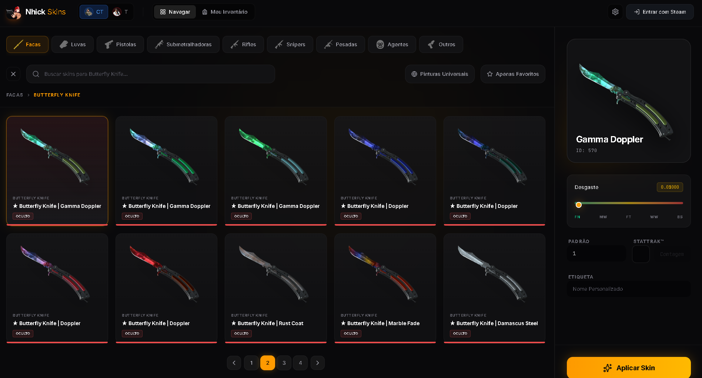

# 🔫 CS2 Loadout Manager (Nhick Skins)



## 📖 Sobre o Projeto

O **CS2 Loadout Manager** é uma interface web moderna, rápida e responsiva que permite aos jogadores escolherem e gerenciarem suas skins de armas, facas, luvas e agentes do Counter-Strike 2. 

Com um design focado na experiência do usuário, o painel facilita a busca por skins específicas, filtragem por raridade e visualização em tempo real do inventário equipado para os lados Terrorista (T) e Contra-Terrorista (CT).

## 🔌 Integração com o Plugin "Weapon Paints"

Este site foi desenvolvido para funcionar em perfeita harmonia com plugins de **[cs2-WeaponPaints](https://github.com/Nereziel/cs2-WeaponPaints)** em servidores da comunidade de CS2. 

**Como funciona:**
1. O jogador acessa este site e faz login (via Steam).
2. Ele escolhe suas skins, facas e luvas favoritas através da interface visual.
3. O site salva essas preferências diretamente no banco de dados (MySQL ou SQLite).
4. O **Plugin de Weapon Paints** instalado no seu servidor de CS2 lê esse banco de dados e aplica as skins instantaneamente nas armas do jogador durante a partida.

## ✨ Funcionalidades

- 🔍 **Busca Avançada:** Encontre skins rapidamente pelo nome ou arma.
- 🎨 **Pinturas Universais:** Aplique a mesma skin para todas as armas compatíveis com um clique.
- 🔪 **Facas e Luvas:** Suporte completo para escolha de facas e luvas personalizadas.
- 🕵️ **Agentes:** Selecione agentes específicos para CT e TR.
- 🌓 **Tema Claro/Escuro:** Interface adaptável à preferência do usuário.
- 📱 **Responsivo:** Funciona perfeitamente em computadores e celulares.

---

## 🚀 Como instalar e rodar na sua VPS

Para hospedar este painel na sua VPS (Linux/Ubuntu), siga os passos abaixo:

### 1. Pré-requisitos
Certifique-se de ter o **Node.js** (versão 18 ou superior) e o **Git** instalados na sua VPS.
```bash
# Atualizar pacotes
sudo apt update && sudo apt upgrade -y

# Instalar Node.js (exemplo usando Node 20)
curl -fsSL https://deb.nodesource.com/setup_20.x | sudo -E bash -
sudo apt-get install -y nodejs

# Instalar PM2 (Gerenciador de processos para manter o site online 24/7)
sudo npm install -g pm2
```

### 2. Configurando o Projeto
Envie os arquivos do projeto para a sua VPS ou clone via Git. Depois, entre na pasta do projeto:

```bash
cd caminho/para/o/projeto

# Instalar as dependências
npm install
```

### 3. Configuração do Banco de Dados e Variáveis
Crie um arquivo `.env` na raiz do projeto baseado no `.env.example`:
```bash
cp .env.example .env
nano .env
```

Dentro do arquivo `.env`, você deve preencher as informações do seu banco de dados MySQL (o mesmo banco que o seu plugin de Weapon Paints usa). Adicione ou modifique as seguintes linhas com os seus dados:

```env
DB_HOST=56.126.2.202   # O IP da sua VPS ou host do banco de dados
DB_PORT=3306           # A porta do MySQL (padrão é 3306)
DB_USER=seu_usuario    # O usuário do banco de dados (ex: api)
DB_PASSWORD=sua_senha  # A senha do banco de dados
DB_NAME=cs2_skins      # O nome do banco de dados do plugin (ex: cs2)
```

*(**Dica de Ouro:** Evite alterar o arquivo `server.ts` diretamente para colocar o IP. Usar o arquivo `.env` é a forma mais segura e correta de configurar as credenciais do seu projeto, pois evita que senhas vazem acidentalmente).*

### 4. Iniciando o Servidor
Para manter o site rodando em segundo plano (mesmo quando você fechar o terminal), use o PM2:

```bash
# Iniciar o servidor
pm2 start npm --name "cs2-skins" -- run dev

# Salvar o processo para iniciar automaticamente se a VPS reiniciar
pm2 save
pm2 startup
```

Pronto! Seu site estará rodando na porta `3000` (ou a porta configurada). Você pode usar o Nginx para configurar um domínio (ex: `skins.seuservidor.com`) apontando para `http://localhost:3000`.
